

  <a href="#" rel="noopener">
 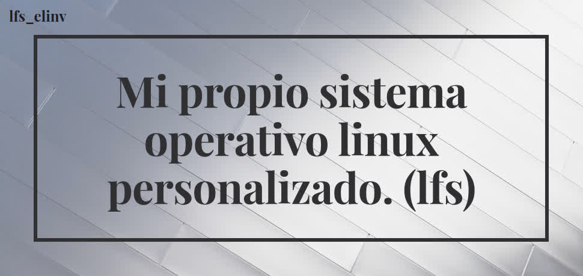</a>

<h3 align="center">LFS Elinv</h3>

---

 🤖 MI PROPIO SISTEMA OPERATIVO LINUX.
      

- [@elinv](https://sites.google.com/view/lfselinv/p%C3%A1gina-principal) - En sites Google

## 📝 Aprendiendo Linux de cero con Linux From Scratch.

En esta primer entrega llegaremos en tiempo record hasta el prompt : I have no name!:/#
Parte III. Construcción del sistema LFS : 6.4. Entrar al entorno chroot.

## 🎥 Acción

## 💭 Sin comentarios

- Linux from scratch x por Elinv
- Lo que verá en los videos esta desarrollado
- y se ha usado para llevar adelante el proyecto:
- Linux_From_Scratch_Version_6.3.iso
- Linux_From_Scratch_Version_6.3.pdf
- menu.tar.gz => bash menu.sh
- ---
            De aquí se pueden bajar
- ---
Linux_From_Scratch_Version_6.3.pdf
https://drive.google.com/open?id=1ae4cd2Wpx_9DSgtJKNxQCEEe7Cv6dlff

Linux_From_Scratch_Version_6.3.iso
https://drive.google.com/open?id=1ECGp_qX7i6jjK8yeGh57oKWFAQSsDr4F

menu.tar.gz => bash menu.sh
https://drive.google.com/open?id=12d3WqUiH0wIZmSAFD5MNI-VjrNWDQ5pt
- ---
      El resto lo observará 
      mirando los videos 
      en Youtube 
      que lo guiarán
      paso a pasó.

      Así podrá acceder 
      en tiempo máximo 3 horas, 
      aunque nosotros 
      lo hemos comprobado
      en menos de 2 horas, 
      al prompt:
      I have no name!:/#
- ---
Esta experiencia de aprendizaje es muy importante!.

## 🎈 Desarrollado en...

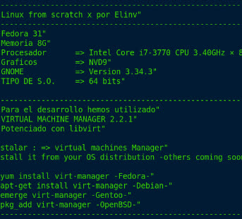

## 🏁 En tiempo real...

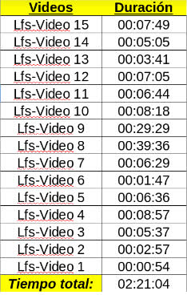

---

- **Elinv Linux From Scratch Versión 6.3 Video n° 1** 
- [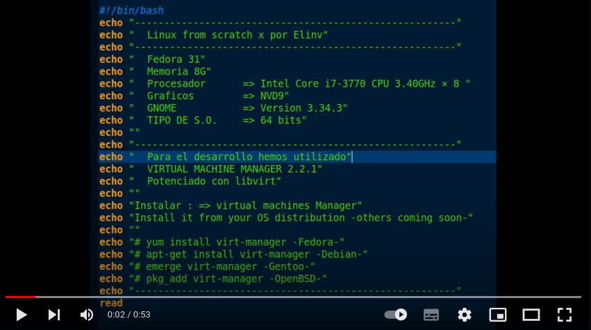](https://youtu.be/nBeMhPitZOM)

---

- **Elinv Linux From Scratch Versión 6.3 Video n° 2** 
- [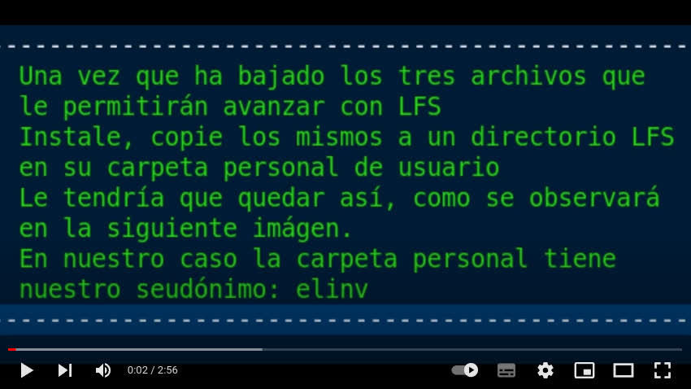](https://www.youtube.com/watch?v=xuz-LA-eYF0)

---

- **Elinv Linux From Scratch Versión 6.3 Video n° 3** 
- [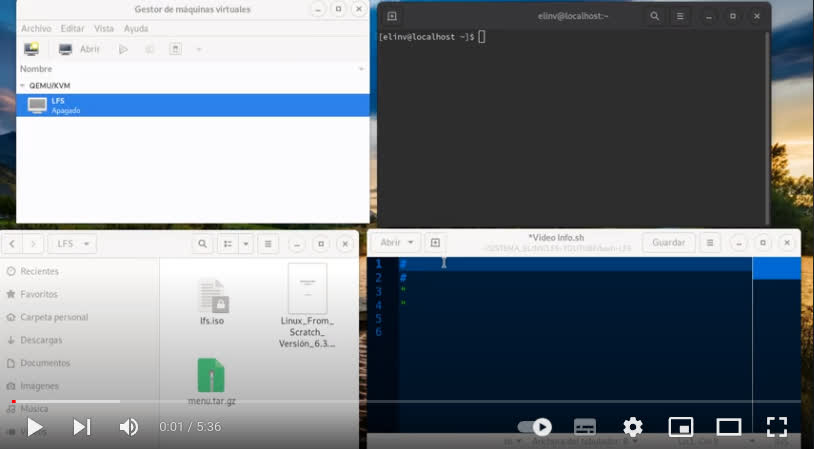](https://www.youtube.com/watch?v=YSIVRTs2-so)

---

- **Elinv Linux From Scratch Versión 6.3 Video n° 4** 
- [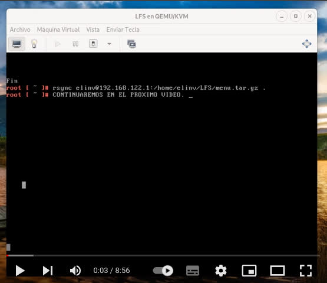](https://www.youtube.com/watch?v=1chDAU6hCzg)

---

- **Elinv Linux From Scratch Versión 6.3 Video n° 5** 
- [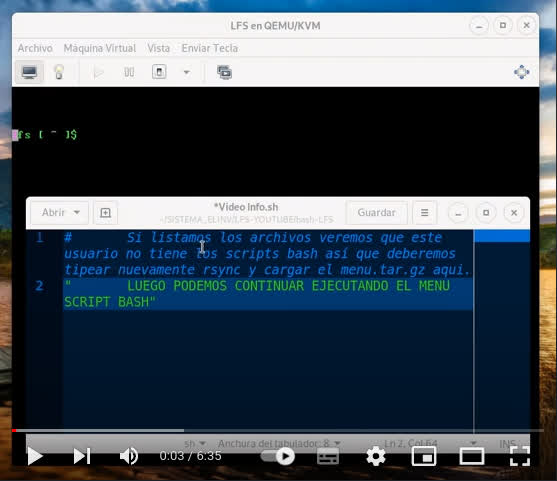](https://www.youtube.com/watch?v=uwaxw7cvgGQ)

---

- **Elinv Linux From Scratch Versión 6.3 Video n° 6** 
- [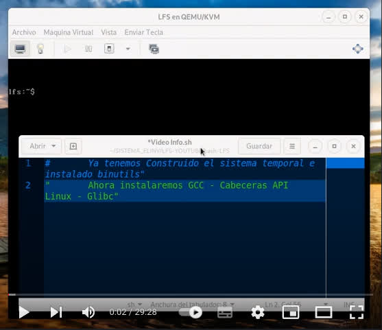](https://www.youtube.com/watch?v=kJpWwUZa_Es)

---

- **Elinv Linux From Scratch Versión 6.3 Video n° 7** 
- [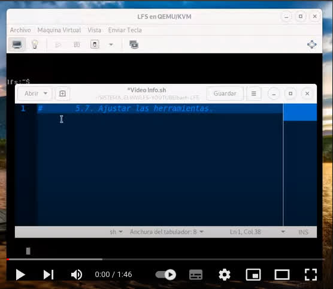](https://www.youtube.com/watch?v=-JLifvQ5kQc)

---

- **Elinv Linux From Scratch Versión 6.3 Video n° 8** 
- [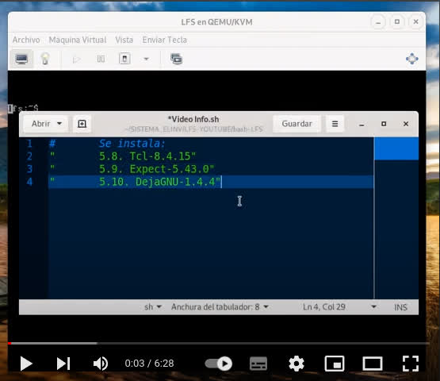](https://www.youtube.com/watch?v=dyKUsEmTFiI)

---

- **Elinv Linux From Scratch Versión 6.3 Video n° 9** 
- [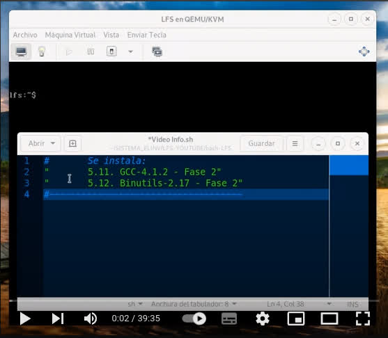](https://www.youtube.com/watch?v=WY_SKizSdw8)

---

- **Elinv Linux From Scratch Versión 6.3 Video n° 10** 
- [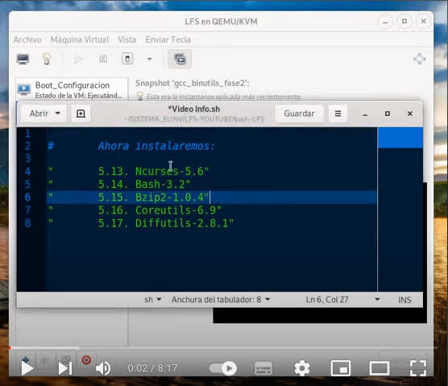](https://www.youtube.com/watch?v=S0N0nmgUhBc)

---

- **Elinv Linux From Scratch Versión 6.3 Video n° 11** 
- [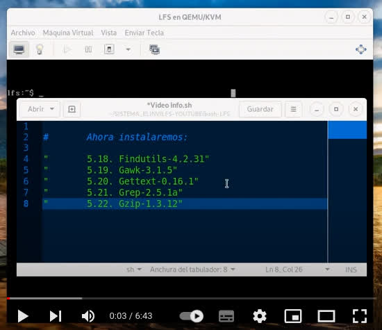](https://www.youtube.com/watch?v=CBim4wX1IRE)

---

- **Elinv Linux From Scratch Versión 6.3 Video n° 12** 
- [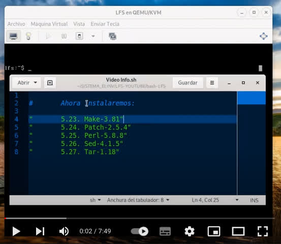](https://www.youtube.com/watch?v=EqyXUiRXJVA)

---

- **Elinv Linux From Scratch Versión 6.3 Video n° 13** 
- [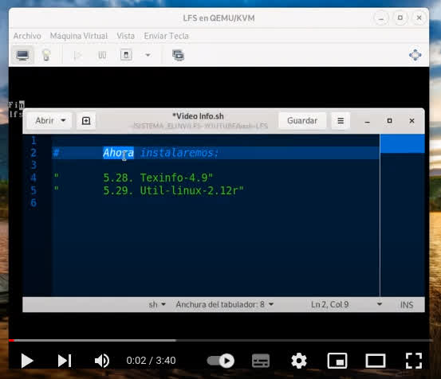](https://www.youtube.com/watch?v=INvgcP-eCz0)

---

- **Elinv Linux From Scratch Versión 6.3 Video n° 14** 
- [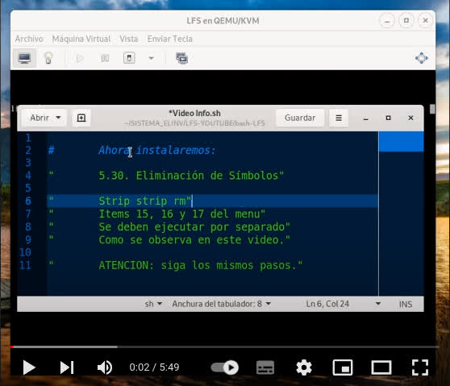](https://www.youtube.com/watch?v=oHFmVL58PbI)

---

- **Elinv Linux From Scratch Versión 6.3 Video n° 15** 
- [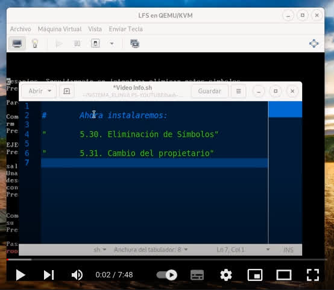](https://www.youtube.com/watch?v=86njJVUrIYc)

- Cualquier duda que tengan la dirigen a elinv@duck.com

-  🛠️ Errores, sugerencias, ideas, envialas a nuestro mail: <elinv@duck.com>

- Ver info de Elinv en Google Search:  
<a href="https://www.google.com.ar/search?q=elinv">
   Enlace a la info de Elinv  -> en Google Search
</a>

- 👍 Saludos!

- Atte.

# Elinv.

